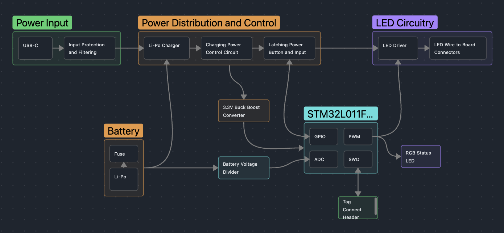
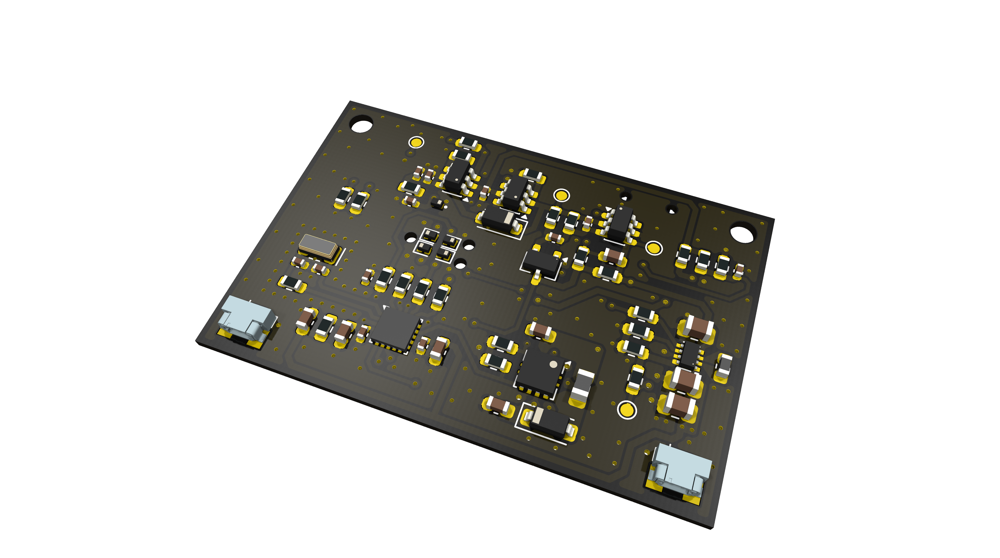
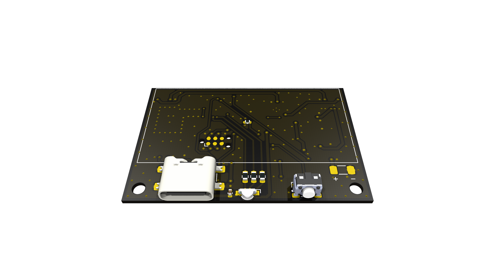

# Circadian Sleep Mask

## Overview
A battery powered sleep mask that gradually illuminates the inside of the mask as the user's alarm approaches. The user sets their sleep duration by pressing a button on the housing, and the device begins lighting up that many hours later. Waking this way is closer to how the body wakes naturally, easing the user out of sleep rather than jolting them awake. It reduces sleep inertia, the grogginess and disorientation that follows an abrupt alarm

[Schematic (PDF)](outputs/schematic/sleep_mask.pdf)

